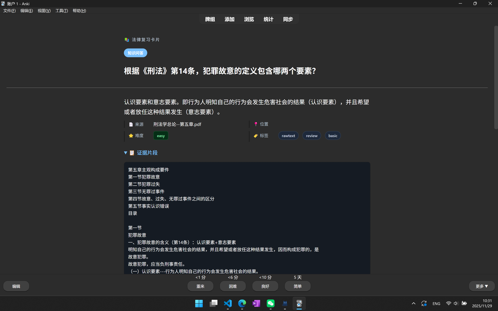
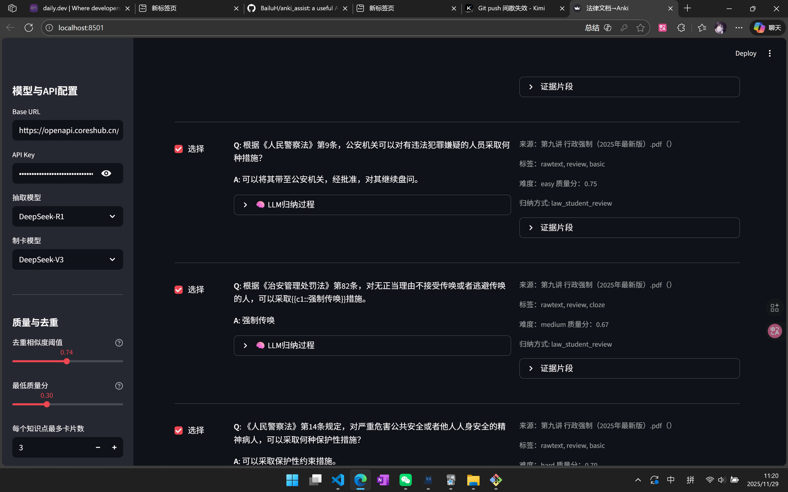

# 🧠 法律文档 → Anki 闪卡助手

一个基于大语言模型的智能法律学习工具，支持上传法律文档（PDF/DOCX/TXT），通过AI智能分析和归纳，自动生成Anki学习卡片，实现高效的法律知识学习。

## ✨ 功能展示

### 🖥️ 主界面

简洁直观的操作界面，支持多文档上传和智能参数配置。

### 📄 智能文档处理


AI智能识别法律文档内容，基于语义理解抽取关键知识点，支持刑法、行政法等各类法律文档。

### 👤 用户预览与确认

用户可预览生成的学习卡片，查看AI归纳过程，并选择性地导出到Anki。

### 🤖 AI智能归纳
- **深度理解**: 大模型对法律知识点进行深度理解和归纳总结
- **教育优化**: 将复杂法律概念转化为易于记忆的学习卡片
- **保持原意**: 在忠实原文基础上进行适当丰富和重构

### 🔍 语义理解关键词抽取
- **超越匹配**: 不仅精确匹配，更能理解法律概念的语义关联
- **智能发现**: 自动识别同义词、相关概念和法律关联
- **全面覆盖**: 发现隐含的相关内容，提高知识召回率

### ✅ 用户确认机制
- **导出前确认**: 用户必须确认最终卡片内容，确保完全控制
- **归纳过程展示**: 透明展示AI的归纳思路，增强可信度
- **选择性导出**: 支持预览和选择性导出，灵活掌控学习内容

## 🚀 快速开始

### 环境要求
- Python 3.9+
- Windows/MacOS/Linux

### 安装步骤

1. **克隆项目**
```bash
git clone <项目地址>
cd anki_assist
```

2. **使用 uv 管理项目**
```bash
# 安装项目依赖（推荐）
uv sync

# 或手动安装依赖
uv pip install -r requirements.txt
```

3. **配置API**
创建 `.env` 文件或在应用界面配置：
```ini
DEEPSEEK_BASE_URL=https://openapi.coreshub.cn/v1
DEEPSEEK_API_KEY=你的API密钥
```

4. **启动应用**
```bash
# 使用 uv 运行应用（推荐）
uv run streamlit run app/streamlit_app.py --server.port 8501

# 或激活虚拟环境后运行
source .venv/bin/activate  # Linux/Mac
# 或
.venv\Scripts\activate     # Windows
streamlit run app/streamlit_app.py --server.port 8501
```
访问：`http://localhost:8501`

### 使用流程

1. **上传文档**: 支持PDF、DOCX、TXT格式，可多文件上传
2. **输入关键词**: 输入法律关键词，AI将基于语义理解发现相关内容
3. **选择模型**: 
   - 抽取模型：DeepSeek-V3（支持语义理解）
   - 制卡模型：DeepSeek-V3 或 DeepSeek-R1（支持智慧归纳）
4. **预览确认**: 查看AI归纳过程和生成的卡片内容
5. **导出使用**: 一键生成 `.apkg` 文件，直接导入Anki学习

## 🏗️ 技术架构

### 核心组件
```
anki_assist/
├─ app/
│  └─ streamlit_app.py         # Streamlit前端界面
├─ pipeline/
│  ├─ graph.py                 # 处理流程总控
│  └─ nodes/
│     ├─ induction.py          # AI智能归纳
│     ├─ extract.py            # 语义理解抽取
│     ├─ generate_cards.py     # 智能卡片生成
│     ├─ quality.py            # 质量控制与去重
│     ├─ ingest.py             # 文档解析
│     ├─ normalize.py          # 文本标准化
│     └─ items_from_text.py    # 文本分块
├─ llm/
│  └─ client.py                # DeepSeek API客户端
├─ anki/
│  ├─ templates.py             # Anki卡片模板
│  └─ exporter.py              # Anki包导出
├─ models/
│  └─ schemas.py               # 数据模型定义
└─ data/                       # 数据存储
   ├─ uploads/                 # 上传文档
   └─ exports/                 # 导出文件
```

### 技术栈
- **前端**: Streamlit
- **AI模型**: DeepSeek-V3/R1
- **文档处理**: PyMuPDF, python-docx
- **卡片生成**: genanki
- **工作流**: LangGraph
- **数据模型**: Pydantic

### 核心特性
- **本地运行**: 保护文档隐私，无需上传云端
- **智能分析**: 基于大语言模型的深度理解
- **语义搜索**: 超越关键词匹配的智能发现
- **质量保证**: 自动质量评分和去重机制
- **用户控制**: 完整的预览和确认机制

## ⚙️ 配置参数

### 质量控制
- **去重相似度阈值**: 0.88（默认）
- **最低质量分**: 0.65（默认）
- **每知识点最多卡片数**: 3（默认）

### AI智能参数
- **语义理解强度**: 自动调节，发现隐含关联
- **归纳教育性**: 保持原意基础上提升学习效果
- **过程透明度**: 展示归纳思路，增强可信度

## 🔍 常见问题

### Q: AI归纳会改变原文意思吗？
A: 不会！系统严格遵循"基于原文"原则，AI只在保持原意基础上进行教育性重构，不会添加外部知识或臆测内容。

### Q: 语义理解发现的内容准确吗？
A: 高准确度！系统会综合直接匹配、同义词、法律关联等多维度判断相关性，确保发现的内容与学习目标相关。

### Q: 用户确认是必须的吗？
A: 是的！这是核心安全机制，确保用户对最终学习内容有完全控制权，可以预览和选择要导出的卡片。

### Q: 支持哪些文档格式？
A: 支持PDF、DOCX、TXT格式，可以同时上传多个文件进行处理。

### Q: 需要联网使用吗？
A: 需要连接AI模型API（DeepSeek），但文档处理完全在本地进行，保护您的隐私安全。

### Q: 生成的Anki卡片兼容性如何？
A: 生成标准的 `.apkg` 格式，兼容所有版本的Anki（桌面版、手机版、网页版）。

## 🗺️ 开发路线图

### 已完成 ✅
- [x] AI智能归纳
- [x] 语义理解抽取
- [x] 用户确认机制
- [x] 多格式文档支持
- [x] 质量控制与去重

### 近期计划 📋
- [ ] 多模态支持：图表、公式的智能理解
- [ ] 个性化学习：基于用户反馈的智能优化
- [ ] 知识图谱：构建法律概念间的智能关联网络
- [ ] 批量处理：支持大规模文档批量处理
- [ ] 模板定制：支持自定义Anki卡片模板

### 长期愿景 🚀
- [ ] 多语言支持：支持中英文法律文档
- [ ] 协作功能：支持团队知识共享
- [ ] 学习分析：提供学习进度和效果分析
- [ ] 移动端：开发移动应用版本

## 🤝 贡献指南

欢迎贡献代码、报告问题或提出功能建议！

1. Fork 项目
2. 创建功能分支 (`git checkout -b feature/AmazingFeature`)
3. 提交更改 (`git commit -m 'Add some AmazingFeature'`)
4. 推送到分支 (`git push origin feature/AmazingFeature`)
5. 创建 Pull Request

## 📄 许可证

本项目采用 MIT 许可证 - 查看 [LICENSE](LICENSE) 文件了解详情。

## 🙏 致谢

- **[spec-kit](https://github.com/github/spec-kit)**: Den的开源项目，本项目使用它作为开发工具

---

**让AI助力您的法律学习之旅！** 🎯

如有问题或建议，欢迎提交 Issue 或联系我们。
