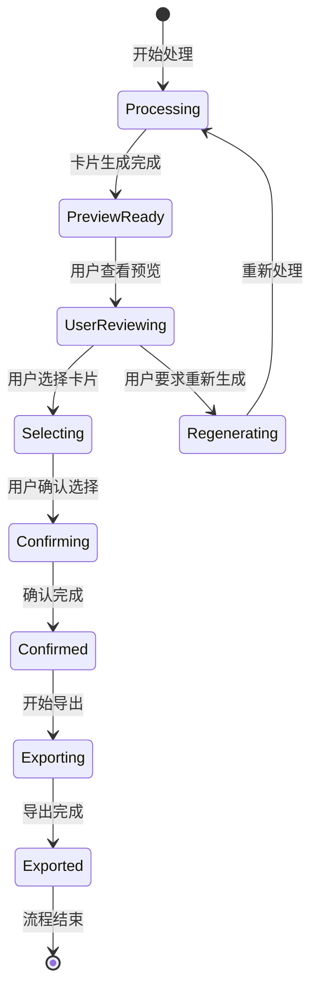

# API Contracts: 管线优化与智能抽取

**Feature**: 001-pipeline-optimization  
**Created**: 2025-11-28  
**Status**: Design Phase  

## 接口概览

由于本项目是本地运行的Streamlit应用，API接口主要在内部模块间调用。以下是关键的数据交换接口定义：

## 内部API接口

### 1. 卡片预览接口

**用途**: 获取当前生成的卡片列表，用于用户预览和确认

```python
# 接口定义
def get_cards_preview() -> Dict[str, Any]:
    """
    获取卡片预览数据
    Returns:
        {
            "cards": List[Card],          # 卡片列表
            "total_count": int,           # 总卡片数
            "confirmed_count": int,       # 已确认卡片数
            "pending_confirmation": int   # 待确认卡片数
        }
    """
```

**调用时机**: 
- 用户完成抽取后
- 用户点击"预览卡片"按钮时

### 2. 卡片确认接口

**用途**: 用户确认或拒绝卡片，控制最终导出内容

```python
# 接口定义
def confirm_cards(card_ids: List[str], confirmed: bool, user_notes: str = "") -> Dict[str, Any]:
    """
    确认或拒绝卡片
    Args:
        card_ids: 要确认的卡片ID列表
        confirmed: 是否确认这些卡片
        user_notes: 用户备注（可选）
    Returns:
        {
            "success": bool,              # 操作是否成功
            "confirmed_count": int,       # 确认成功的卡片数
            "updated_cards": List[Card]   # 更新后的卡片列表
        }
    """
```

**调用时机**:
- 用户在预览界面点击"确认选择"时
- 用户点击"导出Anki包"前进行最终确认

### 3. 卡片重新生成接口

**用途**: 允许用户对不满意的卡片重新生成

```python
# 接口定义  
def regenerate_cards(item_ids: List[str], regenerate_prompt: str = "") -> Dict[str, Any]:
    """
    重新生成指定知识点的卡片
    Args:
        item_ids: 要重新生成的知识点ID列表
        regenerate_prompt: 自定义生成提示（可选）
    Returns:
        {
            "success": bool,          # 操作是否成功
            "new_cards": List[Card]   # 新生成的卡片列表
        }
    """
```

**调用时机**:
- 用户拒绝某些卡片后
- 用户希望优化特定知识点的卡片时

## 数据模型接口

### Card (卡片) 数据结构

```python
class Card(BaseModel):
    # 基础字段（保持不变）
    Question: str                    # 问题文本
    Answer: str                      # 答案文本  
    SourceDoc: str                   # 来源文档名
    SourceLoc: str                   # 具体位置
    Tags: List[str]                  # 标签列表
    Difficulty: str                  # 难度等级
    Evidence: str                    # 证据片段
    quality: float                   # 质量分数
    
    # 新增优化字段
    llm_induction: str = ""          # LLM归纳过程描述
    user_confirmed: bool = False     # 用户确认状态
    confirmation_time: Optional[datetime] = None  # 确认时间
    induction_prompt: str = ""       # 使用的归纳prompt版本
```

### KnowledgePoint (知识点) 数据结构

```python
class KnowledgePoint(BaseModel):
    # 基础字段（保持不变）
    type: str                        # 知识点类型
    title: str                       # 标题
    content: str                     # 内容
    source_doc: str                  # 来源文档
    source_loc: str                  # 具体位置
    evidence: str                    # 证据片段
    tags: List[str]                  # 标签
    
    # 新增优化字段
    semantic_matches: List[str] = [] # 语义匹配的相关关键词
    induction_quality: float = 0.0   # LLM归纳质量评分
    induction_notes: str = ""        # 归纳过程说明
    structural_score: float = 0.0    # 文档结构重要性评分
```

## 状态管理接口

### 会话状态接口

```python
# Streamlit session_state 键定义
SESSION_KEYS = {
    "pipeline_output": "管线输出结果",
    "cards_selected": "用户选择的卡片",
    "confirmation_status": "确认状态",
    "preview_mode": "预览模式",
    "regenerate_items": "需要重新生成的项目"
}
```

### 流程状态转换



## 错误处理接口

### 错误码定义

```python
ERROR_CODES = {
    1001: "LLM归纳失败",
    1002: "用户确认超时", 
    1003: "卡片生成失败",
    1004: "预览数据获取失败",
    1005: "确认状态更新失败"
}
```

### 错误响应格式

```python
{
    "error": {
        "code": int,          # 错误码
        "message": str,       # 错误信息
        "details": str,       # 详细说明
        "suggestion": str     # 解决建议
    }
}
```

## 性能接口

### 处理时间预估

```python
# 各阶段预估处理时间（基于测试）
PROCESSING_TIMES = {
    "semantic_extraction": "2-5秒/文档",      # 语义理解抽取
    "llm_induction": "3-8秒/知识点",         # LLM智慧归纳
    "card_generation": "1-3秒/卡片",         # 卡片生成
    "user_confirmation": "用户操作时间",      # 用户确认时间
    "export_generation": "5-10秒/卡组"       # Anki包生成
}
```

## 兼容性保证

### 向后兼容
1. 所有新增字段都有默认值
2. 现有API接口保持不变
3. 新增功能为可选特性

### 数据迁移
1. 老数据缺少新字段时自动填充默认值
2. 逐步迁移，不影响现有功能使用
3. 提供数据完整性检查机制

## 下一步实现

1. 实现卡片预览数据获取逻辑
2. 开发用户确认状态管理
3. 设计LLM归纳prompt模板
4. 优化确认界面交互体验