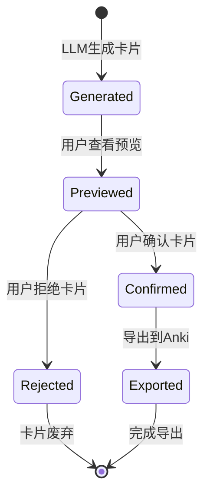
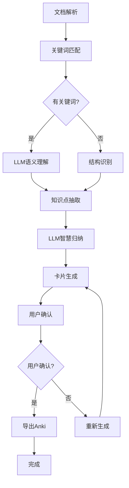

# Data Model: 管线优化与智能抽取

**Feature**: 001-pipeline-optimization  
**Created**: 2025-11-28  
**Status**: Design Phase  

## Entity Enhancements

### 1. KnowledgePoint (知识点) 增强

基于优化需求，在现有基础上增加以下字段：

```python
class KnowledgePoint(BaseModel):
    # 现有字段保持不变
    type: str  # 类型: Statute, JudicialInterpretation, Case, KeywordHit
    title: str  # 标题
    content: str  # 内容
    source_doc: str  # 来源文档
    source_loc: str  # 具体位置
    evidence: str  # 证据片段
    tags: List[str]  # 标签
    
    # 新增优化字段
    semantic_matches: List[str] = []  # 语义匹配的相关关键词
    induction_quality: float = 0.0  # LLM归纳质量评分 (0-1)
    induction_notes: str = ""  # 归纳过程说明
    structural_score: float = 0.0  # 文档结构重要性评分
```

**设计理由**:
- `semantic_matches`: 记录LLM语义理解发现的相关概念
- `induction_quality`: 为后续LLM卡片生成提供质量参考
- `structural_score`: 基于文档结构的重要性评估
- 保持与现有代码的向后兼容性

### 2. Card (卡片) 增强

为支持LLM智慧归纳和用户确认流程：

```python
class Card(BaseModel):
    # 现有字段保持不变
    Question: str  # 问题
    Answer: str  # 答案
    SourceDoc: str  # 来源文档
    SourceLoc: str  # 具体位置
    Tags: List[str]  # 标签
    Difficulty: str  # 难度
    Evidence: str  # 证据片段
    quality: float  # 质量分数
    
    # 新增优化字段
    llm_induction: str = ""  # LLM归纳过程描述
    user_confirmed: bool = False  # 用户确认状态
    confirmation_time: Optional[datetime] = None  # 确认时间
    induction_prompt: str = ""  # 使用的归纳prompt版本
```

**设计理由**:
- `llm_induction`: 记录LLM的归纳思路，便于用户理解和验证
- `user_confirmed`: 支持导出前的用户确认流程
- `induction_prompt`: 追踪使用的prompt版本，便于优化
- 保持genanki兼容性，新增字段为可选

### 3. ExtractionConfig (抽取配置) 增强

为支持优化功能：

```python
class ExtractionConfig(BaseModel):
    # 现有字段保持不变
    api_base: str
    api_key: str
    extract_model: str
    card_model: str
    dedup_threshold: float
    min_quality: float
    max_cards_per_item: int
    
    # 新增优化字段
    semantic_similarity: float = 0.7  # 语义相似度阈值
    induction_temperature: float = 0.3  # LLM归纳温度参数
    require_confirmation: bool = True  # 是否需要用户确认
    confirmation_deadline: Optional[int] = None  # 确认超时时间(分钟)
```

**设计理由**:
- `semantic_similarity`: 控制语义理解的宽松程度
- `induction_temperature`: 调节LLM归纳的创造性
- `require_confirmation`: 支持灵活的用户确认机制

## State Transitions

### 卡片生命周期状态



### 知识点处理流程



## API Contract Updates

### 新增接口

#### 1. 获取卡片预览
```
GET /api/cards/preview
Response: {
  cards: Card[],
  total_count: number,
  confirmed_count: number,
  pending_confirmation: number
}
```

#### 2. 确认卡片
```
POST /api/cards/confirm
Request: {
  card_ids: string[],
  confirmed: boolean,
  user_notes?: string
}
Response: {
  success: boolean,
  confirmed_count: number,
  updated_cards: Card[]
}
```

#### 3. 重新生成卡片
```
POST /api/cards/regenerate
Request: {
  item_ids: string[],
  regenerate_prompt?: string
}
Response: {
  success: boolean,
  new_cards: Card[]
}
```

## Data Validation Rules

### 新增验证规则

1. **语义相似度阈值**: 0.1-1.0，默认0.7
2. **归纳温度**: 0.0-1.0，默认0.3（保守）
3. **确认超时**: 可选，默认无超时
4. **LLM归纳质量**: 0.0-1.0，基于生成质量评估

### 数据完整性要求

1. 所有卡片在导出前必须设置`user_confirmed=true`
2. `llm_induction`字段记录归纳过程，便于追踪
3. 保持与现有数据库模式的向后兼容

## Performance Considerations

### 新增字段影响
- 语义匹配可能增加处理时间
- LLM归纳是计算密集型操作
- 用户确认增加交互延迟

### 优化策略
1. 语义匹配结果可缓存
2. LLM归纳可异步处理
3. 批量确认提升用户体验

## 与现有系统兼容性

### 向后兼容保证
1. 所有新增字段都有默认值
2. 现有API接口保持不变
3. 数据库迁移可安全执行

### 迁移计划
1. 新增字段允许为空
2. 逐步填充新字段数据
3. 老数据保持可用状态

## 下一步实现重点

1. 设计LLM归纳prompt模板
2. 实现用户确认界面
3. 优化语义理解算法
4. 完善数据验证逻辑