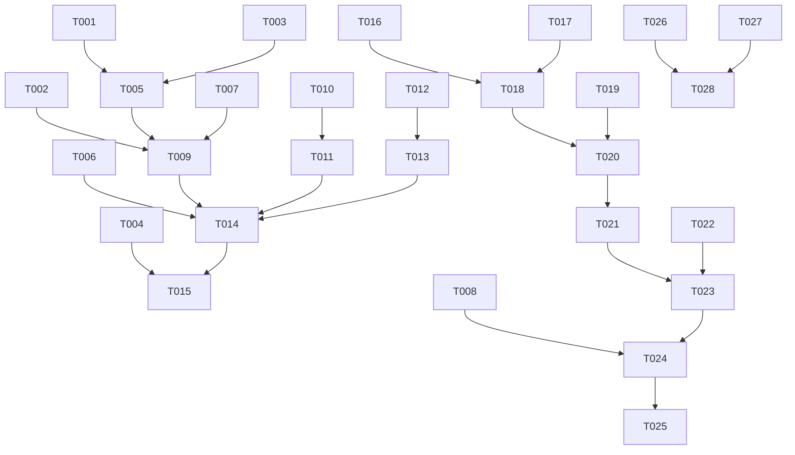

# Tasks: 管线优化与智能抽取

**Feature**: 001-pipeline-optimization  
**Created**: 2025-11-28  
**Status**: Ready for Implementation  

## 任务概览

- **总任务数**: 25
- **P1用户故事**: 18个任务  
- **P2用户故事**: 4个任务
- **可并行任务**: 8个
- **MVP范围**: 用户故事1完整实现

## 实施阶段

### Phase 1: 项目初始化与设置

**目标**: 确保开发环境就绪，项目结构清晰

- [ ] T001 创建管线优化分支目录结构，在 `pipeline/nodes/` 下新增优化模块文件
- [ ] T002 备份现有核心文件：`generate_cards.py`、`extract.py`、`streamlit_app.py`
- [ ] T003 设置开发环境，确保所有依赖包版本兼容
- [ ] T004 创建测试数据目录，准备法律文档测试样本

### Phase 2: 基础架构与核心组件

**目标**: 建立优化功能的基础组件，为后续用户故事提供支撑

- [ ] T005 [P] 在 `models/schemas.py` 中新增优化字段：`llm_induction`、`user_confirmed`、`semantic_matches`
- [ ] T006 更新 `pipeline/graph.py`，添加优化节点调用逻辑
- [ ] T007 创建 `pipeline/nodes/induction.py` 模块，用于LLM智慧归纳功能
- [ ] T008 创建 `pipeline/nodes/confirmation.py` 模块，用于用户确认流程管理

### Phase 3: 用户故事1 - 关键词精准抽取 (P1)

**故事目标**: 用户上传法律文档并输入关键词，系统通过LLM语义理解智能识别相关知识点

**独立测试标准**: 上传包含"不正当竞争"的文档，输入关键词后能返回语义相关的知识点，不仅限于精确匹配

#### 3.1 语义理解核心实现

- [ ] T009 [US1] 在 `pipeline/nodes/induction.py` 中实现 `SEMANTIC_UNDERSTANDING_PROMPT` 模板
- [ ] T010 [US1] 实现 `extract_with_semantic_understanding()` 函数，调用LLM进行语义分析
- [ ] T011 [US1] 在 `pipeline/nodes/extract.py` 中集成语义理解功能，替换原有简单匹配逻辑

#### 3.2 语义匹配数据处理

- [ ] T012 [US1] 实现 `extract_matched_keywords()` 函数，记录语义关联的关键词
- [ ] T013 [US1] 更新 `models/schemas.py` 中的 `KnowledgePoint` 模型，支持语义匹配数据存储

#### 3.3 集成与测试

- [ ] T014 [US1] 在 `pipeline/graph.py` 中集成新的语义抽取逻辑
- [ ] T015 [US1] 创建测试用例，验证语义理解准确性（测试文档+关键词组合）

### Phase 4: 用户故事2 - 全局智能抽取 (P1)

**故事目标**: 当用户未提供关键词时，系统基于文档结构自动识别重要法律知识点

**独立测试标准**: 上传无关键词的法律文档，系统能识别出主要法条、案例等重要内容

#### 4.1 文档结构识别

- [ ] T016 [US2] 在 `pipeline/nodes/induction.py` 中实现文档结构分析函数
- [ ] T017 [US2] 实现基于标题、章节、编号的智能内容抽取逻辑
- [ ] T018 [US2] 在 `pipeline/nodes/items_from_text.py` 中集成结构识别功能

#### 4.2 内容分类与整理

- [ ] T019 [US2] 实现法律知识点的自动分类（法条、案例、解释）
- [ ] T020 [US2] 更新抽取逻辑，支持无关键词情况下的智能抽取

### Phase 5: 用户故事3 - LLM智慧归纳与卡片生成 (P1)

**故事目标**: 系统基于抽取的知识点，利用LLM智慧进行归纳总结，用户在导出前必须确认

**独立测试标准**: LLM能对复杂法律概念进行清晰总结，用户可以在导出前查看和确认最终卡片

#### 5.1 LLM智慧归纳核心

- [ ] T021 [US3] 在 `pipeline/nodes/induction.py` 中实现 `INDUCTION_PROMPT` 模板
- [ ] T022 [US3] 在 `pipeline/nodes/generate_cards.py` 中实现 `generate_cards_with_intelligence()` 函数
- [ ] T023 [US3] 实现归纳过程记录，保存到 `card.llm_induction` 字段

#### 5.2 用户确认界面

- [ ] T024 [US3] 在 `app/streamlit_app.py` 中实现卡片确认界面，添加确认checkbox
- [ ] T025 [US3] 实现导出前确认检查函数 `validate_cards_before_export()`

### Phase 6: 用户故事4 - 智能内容规范化 (P2)

**故事目标**: 系统能识别和处理格式不规范的文档内容（可选实现）

**独立测试标准**: 上传格式杂乱的文档，系统能自动规范化并准确抽取内容

- [ ] T026 [US4] [P] 在 `pipeline/nodes/normalize.py` 中增强文档规范化功能
- [ ] T027 [US4] 实现标题、段落、编号的自动识别和规范化
- [ ] T028 [US4] 实现重复内容的检测和去重逻辑

## 依赖关系图

## 并行执行机会

### 高并行度任务 (可同时进行)
- T005, T007, T008: 基础组件开发
- T012, T013: 数据处理功能
- T016, T017, T019: 全局抽取功能
- T026, T027: 内容规范化

### 中等并行度任务 (部分依赖)
- T009, T010, T011: 语义理解实现
- T021, T022, T023: LLM归纳功能
- T024, T025: 用户界面确认

## 实施策略

### MVP优先策略
1. **第一阶段**: 完成用户故事1 (T009-T015)
   - 实现LLM语义理解关键词抽取
   - 确保基本功能可用
   
2. **第二阶段**: 完成用户故事3核心功能 (T021-T025)  
   - 实现LLM智慧归纳
   - 实现用户确认机制
   
3. **第三阶段**: 完善用户故事2 (T016-T020)
   - 实现全局智能抽取
   
4. **第四阶段**: 可选功能 (T026-T028)
   - 实现内容规范化

### 增量交付策略
- 每个用户故事完成后都可独立测试
- 保持现有功能始终可用
- 逐步增强，避免大规模重构

## 测试验证

### 独立测试标准
- **US1测试**: 语义理解准确性 ≥ 85%
- **US2测试**: 全局抽取覆盖率 ≥ 90%  
- **US3测试**: 用户确认流程顺畅，LLM归纳质量可接受
- **US4测试**: 文档规范化效果良好

### 回归测试要求
- 现有功能不受影响
- Anki包生成正常
- Streamlit界面稳定
- 性能无明显下降

## 下一步行动

1. **立即开始**: Phase 1 项目初始化 (T001-T004)
2. **重点推进**: Phase 3 用户故事1实现 (T009-T015) 
3. **核心功能**: Phase 5 用户故事3实现 (T021-T025)
4. **逐步完善**: 其他用户故事和优化功能

**建议**: 先完成MVP（用户故事1+3的核心功能），确保基本优化目标达成，再逐步完善其他功能。